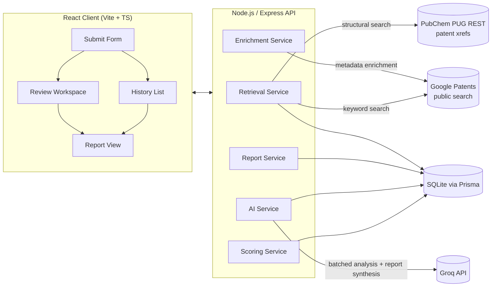

# PatentPilot

**AI-assisted Freedom-to-Operate (FTO) Workspace** — helps a researcher check whether a molecule may already be covered by existing patents, using real public chemistry and patent data plus AI-generated, grounded explanations.

Built for the Centella AI Therapeutics AI Product Engineering Internship Assessment.

---

## Table of Contents

1. [Architecture](#1-overall-architecture)
2. [Retrieval Strategy](#2-retrieval-strategy)
3. [AI Workflow](#3-ai-workflow)
4. [Technologies Used](#4-technologies-used)
5. [Assumptions](#5-assumptions-made)
6. [Trade-offs](#6-trade-offs)
7. [Future Improvements](#7-future-improvements)
8. [Running Locally](#8-instructions-for-running-the-project-locally)

---

## 1. Overall Architecture



**Request lifecycle for one analysis:**
1. User submits a SMILES string (+ optional target/disease) → backend validates it against PubChem and creates an `Analysis` record
2. Backend runs hybrid retrieval in parallel (structural + keyword — see below)
3. Results are merged, deduplicated by patent number, and each is enriched with title/abstract/assignee/date via Google Patents
4. Estimated patent expiry is calculated for each result (publication date + 20 years)
5. Per-patent AI explanations are generated in batches (not one call per patent) and cached
6. Once the user finishes reviewing, a rule-based recommendation is computed and an AI-synthesized report is generated (also cached)
7. Everything persists to the database and is viewable again anytime from History

---

## 2. Retrieval Strategy

The core requirement of this project isn't just "find patents" — it's **identify the most relevant ones**, not just display raw search results. PatentPilot does this with a **hybrid retrieval approach** combining two independent signals:

### 1. Structural retrieval (primary signal)
SureChEMBL's public REST API — the source originally planned for structural search — no longer exposes a working synchronous search endpoint (confirmed via direct testing; it returns 404s for the documented search paths). Instead, PatentPilot uses **PubChem's own patent cross-reference endpoint**:
```
GET /compound/cid/{cid}/xrefs/PatentID/JSON
```
This returns real patents that cross-reference the molecule's exact PubChem Compound ID (CID) — meaning the patent has explicitly disclosed or cited this precise molecule. Since this is an exact CID match rather than a fuzzy similarity search, these hits are scored as exact structural matches (100).

*Trade-off:* this favors precision over recall — it will miss patents describing a near-identical-but-not-identical structure, which a true fingerprint/Tanimoto similarity search (like SureChEMBL's original design) would catch. See Future Improvements.

*Known limitation:* PubChem's cross-reference list includes any patent that cites the CID anywhere in its text — including as a reference compound or comparator — not exclusively patents where the molecule is the core invention. This occasionally surfaces tangentially related patents (e.g. a molecule used as a minor formulation ingredient in an unrelated patent) alongside genuinely on-point ones.

### 2. Keyword retrieval (secondary/fallback signal)
Not every relevant patent will trip a structural match — a patent might claim a broader compound class or a method without citing this exact CID. PatentPilot also searches **Google Patents' public search** using the compound's PubChem synonyms plus the optional Target and Disease/Indication fields, catching context-relevant patents that the structural search alone would miss. Google Patents is explicitly listed as an approved data source in the assessment brief.

### Merge, dedupe, and scoring
Results from both paths are merged by patent number and deduplicated. Each patent is tagged with which method(s) found it (Structural / Keyword / Both) — a "Both" tag is the highest-confidence signal, since it means two independent methods agree.

---

## 3. AI Workflow

**Provider:** Groq API (OpenAI-compatible endpoint), currently using a Groq-hosted open model (model ID kept in a single named config constant, not hardcoded across files — Groq has deprecated models mid-cycle before, so this makes swapping providers/models a one-line change).

**Why Groq over Gemini:** started on Gemini, but hit repeated free-tier daily quota exhaustion and mid-project model deprecations (`gemini-2.5-flash` was blocked for new API keys ahead of its published shutdown date). Groq's free tier offers a substantially higher daily request ceiling, plus faster inference via its custom LPU hardware — both of which matter more once you're running structured, repeated calls across dozens of patents per analysis.

**Grounded generation (avoiding hallucination):** every AI call is grounded — the model only receives the actual retrieved data (real patent title/abstract/assignee, the submitted molecule/target/disease) and is explicitly instructed to reason only from that text, not from its own training knowledge. This is a lightweight form of Retrieval-Augmented Generation: retrieve real data first, then generate text about *that* data.

**Batched per-patent analysis:** rather than one API call per patent (which doesn't scale — a 40-patent analysis would mean 40+ calls), patents are grouped and analyzed in batches per call, with the model returning a structured JSON array of explanations. This cut per-analysis API usage from dozens of calls down to a handful.

**Per-patent explanation covers:** why the patent was retrieved, which aspects appear similar, what overlap exists, and a confidence level (Low/Medium/High) with a one-line reason.

**Report synthesis:** one additional call, grounded in all per-patent explanations plus the computed recommendation, produces the five-section patentability report (see below).

**LLM response caching:** every AI call (per-patent batch and report synthesis) is cached in the `LlmCache` table, keyed by a hash of its exact inputs. Re-analyzing the same molecule/patent combination, or regenerating the same report, is served from cache instead of hitting the API again — this reduces both cost/latency and how quickly free-tier rate limits get consumed.

### Patentability Scoring (rule-based, not ML)

Deliberately **not** a black-box ML classifier — there's no labeled training data available for this task, and in a domain adjacent to legal/patent risk, an explainable, auditable rule is more defensible than an opaque score. The recommendation formula:

```
IF any structural-match patent has score ≥ 85 AND is not expired  → High Patent Risk
ELSE IF any structural-match patent exists (any score)
      OR ≥3 keyword-match patents with score ≥ 60             → Requires Expert Review
ELSE (no structural hits, weak/no keyword hits)                 → Low Patent Risk
```

Patent expiry is estimated as publication date + 20 years (standard patent term), clearly labeled as an estimate, not legal advice. Expired patents are weighted down in the risk calculation, since they may no longer be legally enforceable.

The final report always shows this logic applied to the real numbers for that analysis — the recommendation is explainable, not just asserted.

---

## 4. Technologies Used

| Layer | Technology |
|---|---|
| Frontend | React (Vite) + TypeScript |
| Backend | Node.js + Express (TypeScript) |
| Database | SQLite via Prisma ORM (see Assumptions) |
| AI | Groq API (OpenAI-compatible chat completions) |
| Molecule data | PubChem PUG REST API |
| Structural patent retrieval | PubChem PUG REST patent cross-reference endpoint |
| Keyword patent retrieval + metadata enrichment | Google Patents public search + page fetch |
| PDF export | Client/server-side PDF generation for the report view |

---

## 5. Assumptions Made

- Public APIs (PubChem, Google Patents) are used without authentication and may rate-limit under heavy concurrent load — acceptable for an assessment-scale demo, not production traffic
- SQLite is used for local development/demo purposes instead of PostgreSQL (originally planned) — swapping the Prisma datasource to PostgreSQL is a config change, not a schema rewrite, since the schema itself is already relational and PostgreSQL-compatible
- Patent expiry is a heuristic estimate (publication + 20 years) and explicitly not legal advice
- Google Patents search coverage skews toward well-indexed jurisdictions (US, EP, WO, CN, JP); exhaustive global coverage isn't guaranteed
- The submitted Target/Disease fields are intended to broaden keyword retrieval; in current testing their influence on result sets was inconsistent and warrants further validation (see Future Improvements)

---

## 6. Trade-offs

- **Structural retrieval via PubChem cross-reference vs. true fingerprint/Tanimoto similarity search:** chosen because SureChEMBL's public search API no longer functions synchronously as documented. PubChem's approach is simpler and reuses an already-integrated service, at the cost of missing near-identical (not exact-CID) structural matches, and occasionally surfacing patents where the molecule is cited but not central to the invention.
- **Rule-based risk scoring vs. an ML classifier:** fully explainable and auditable, with zero dependency on unavailable labeled training data — the right choice here even setting aside the time constraint.
- **Groq (open-source models) vs. Gemini/OpenAI (proprietary):** chosen for free-tier reliability (higher daily request ceiling, fewer mid-project deprecation surprises) and inference speed, at the cost of not having access to a closed frontier model — acceptable for this task's structured extraction/summarization workload.
- **Batched AI calls vs. one call per patent:** meaningfully reduces API usage and latency, at the cost of slightly more complex prompt/response parsing (structured JSON arrays instead of single objects).

---

## 7. Future Improvements

- True fingerprint-based structural similarity search (Tanimoto scoring) as a third retrieval signal, catching near-identical structures that exact-CID cross-referencing misses
- Precision filtering on structural hits to distinguish "molecule is the core invention" from "molecule is cited/referenced only"
- Investigate and fix inconsistent influence of the Target/Disease fields on keyword retrieval results
- International/non-English patent coverage beyond what Google Patents search surfaces well
- A more granular novelty-concern scoring model, and multi-user accounts with shared analysis history
- Production-grade PostgreSQL deployment (schema is already compatible; currently running on SQLite for local development)

---

## 8. Instructions for Running the Project Locally

### Prerequisites
- Node.js (v18+)
- npm

### 1. Clone the repository
```bash
git clone https://github.com/satyaprakash-22/PatentPilot.git
cd PatentPilot
```

### 2. Backend setup
```bash
cd server
npm install
```

Create a `.env` file in `server/` (copy from `.env.example`) with:
```
DATABASE_URL="file:./dev.db"
GROQ_API_KEY=your_groq_api_key_here
```

Get a free Groq API key at [console.groq.com](https://console.groq.com) — no credit card required.

Set up the database:
```bash
npx prisma db push
```

Start the backend:
```bash
npm run dev
```
Backend runs on `http://localhost:3001`.

### 3. Frontend setup
In a new terminal:
```bash
cd client
npm install
npm run dev
```
Frontend runs on `http://localhost:5173`.

### 4. Try it out
Open `http://localhost:5173`, submit a molecule SMILES string (e.g. `CC(=O)OC1=CC=CC=C1C(=O)O` for Aspirin), and walk through the full pipeline: molecule resolution → patent discovery → review workspace → AI analysis → patentability report.

---

## Disclaimer

This tool is an assessment/demo project. Patent expiry estimates, risk recommendations, and AI-generated explanations are not legal advice. Always consult a qualified patent attorney for a definitive Freedom-to-Operate assessment.